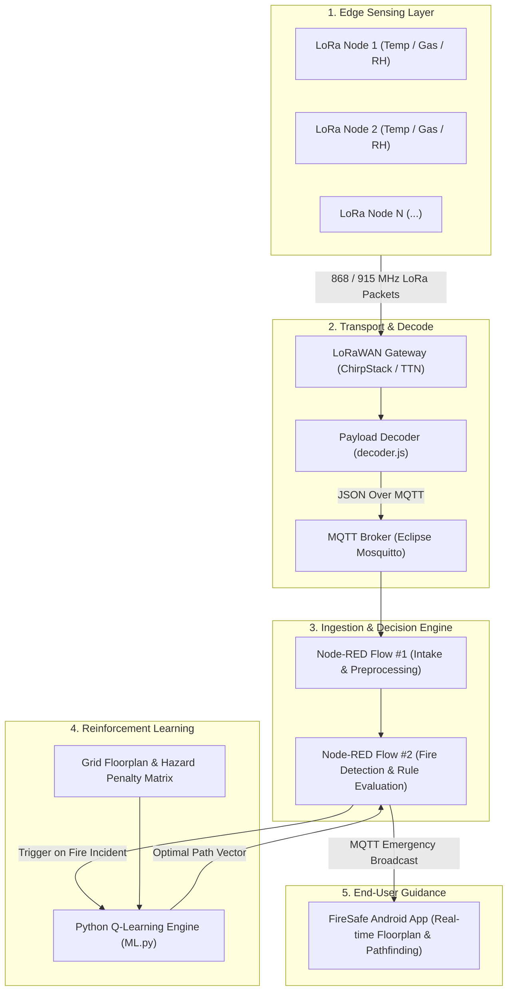
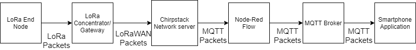
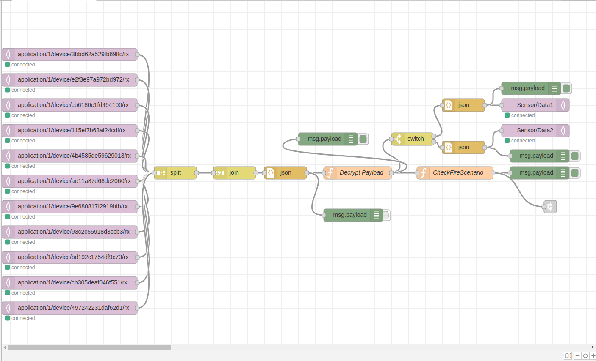
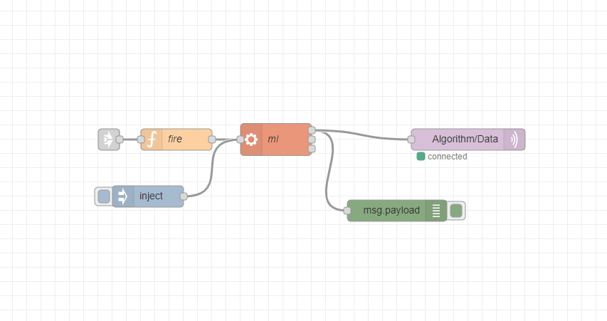
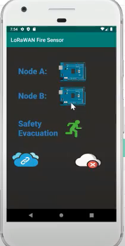
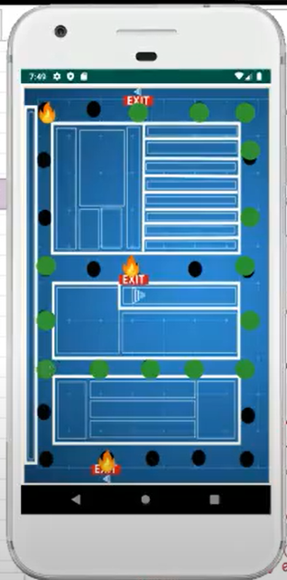

# 🚒 FireSafetyCapstone: IoT & ML-Driven Smart Building Evacuation System

[](LICENSE)
[](Node_Code/)
[](Machine_Learning%20Code/)
[](Android%20Studio/)
[](Node-Red%20Flows/)

> **4th Year Engineering Capstone Project**  
> Department of Electrical, Computer & Biomedical Engineering  
> **Ryerson University (Toronto Metropolitan University)**

---

## 📋 Overview

In high-density urban structures and modern high-rise buildings, traditional fire alarms provide auditory alerts but zero situational awareness—frequently leaving occupants unable to determine safe evacuation paths around spreading fires, smoke, or blocked exits.

**FireSafetyCapstone** is a decentralized, intelligent fire monitoring and dynamic evacuation system that combines:
1. **Low-power LoRa wireless sensor nodes** continuously monitoring thermal, combustible gas, and humidity levels.
2. **LoRaWAN Gateway & MQTT Broker** for resilient long-range communication.
3. **Node-RED Telemetry & Decision Engine** for continuous ingestion, threshold classification, and incident orchestration.
4. **Q-Learning Reinforcement Learning Engine** that models real-time hazard zones as dynamic penalties and calculates the optimal, safest evacuation route around active fire cells to the nearest exit.
5. **Real-time Mobile Android App** displaying live floorplans, active hazard locations, and step-by-step escape navigation for building occupants.

---

## 🏗️ System Architecture & Data Pipeline



---

## 🧩 Subsystem Breakdown

### 1. Edge Sensor Nodes (`Node_Code/`)
- Built on Arduino with Dragino LoRa shields.
- Interfaces with environmental sensors:
  - **Temperature & Relative Humidity**: Continuous atmospheric monitoring.
  - **Gas Sensor (MQ Series)**: Detection of combustion byproducts, carbon monoxide, and smoke.
- **Efficient Binary Packing**: Samples telemetry, encodes values into a compact 6-byte binary payload, and broadcasts via LoRaWAN at regular intervals to conserve battery power.

### 2. LoRaWAN Gateway & Decoder (`LORA_Gateway/`)
- Relays wireless uplinks from the sub-gigahertz LoRa frequency band to standard TCP/IP.
- Includes [`decoder.js`](LORA_Gateway/decoder.js) for The Things Network (TTN) and ChirpStack to transform byte buffers into structured JSON metrics (`celsius`, `gas`, `humidity`).

### 3. Node-RED Ingestion & Incident Engine (`Node-Red Flows/`)
- **Flow 1 (`Decrypt+Fire.json`)**: Preprocesses and aggregates incoming telemetry from distributed nodes across building floors (simulated with an 11-node layout).
- **Flow 2 (`RunML.json`)**: Evaluates environmental parameters against danger thresholds. When a fire condition is confirmed, it calls the Python ML subsystem with the incident coordinates and forwards the computed escape vectors to the MQTT broker.

### 4. Reinforcement Learning Pathfinding (`Machine_Learning Code/`)
- Implements a **Q-learning** reinforcement learning algorithm (`ML.py`, `World.py`).
- Maps floorplans from coordinate matrices (`Q-Maps/custom_map_2.txt`):
  - `0`: Open traversable hallway / room.
  - `1`: Solid structural walls.
  - `2`: Occupant start position.
  - `3`: Safe building exit (Goal / positive reward).
  - `4`: Active fire / hazard zones (Pits / large negative penalty).
- Dynamic convergence produces an ordered coordinate list representing the safest, lowest-hazard route to an exit.

### 5. Mobile Evacuation Client (`Android Studio/`)
- Native Android app (`FireSafe-FireSafe`) written in Java.
- Connects to the centralized MQTT broker to listen for emergency alerts.
- Renders an interactive canvas floorplan:
  - **Black dots**: Sensor node network locations.
  - **Flame icons**: Actively detected fire zones.
  - **Green path overlay**: Real-time optimal escape trajectory computed by the Q-learning engine.

---

## 📸 Screenshots & Flow Models

### Data Flow Model


### Node-RED Telemetry Ingestion (Flow #1)

*Simulated 11-node sensor grid suitable for a single commercial floor.*

### Incident Detection & ML Execution (Flow #2)

*Automated trigger executing the Python Q-learning engine upon threshold breach.*

### Android Evacuation Client
| Normal Home Screen | Active Evacuation Route with Fire Avoidance |
| :---: | :---: |
|  |  |
| *Building status & node health overview* | *Green path indicates optimal escape trajectory avoiding fire cells* |

---

## 📂 Repository Structure

```
FireSafetyCapstone/
├── Android Studio/
│   └── FireSafe-FireSafe/          # Native Android client (Java / Gradle)
├── LORA_Gateway/
│   ├── decoder.js                  # Standardized TTN / ChirpStack payload decoder
│   └── LORA Gateway Decode         # Original decode reference
├── Machine_Learning Code/
│   ├── ML.py                       # Q-learning reinforcement learning pathfinding
│   ├── World.py                    # Grid world environment loader & collision logic
│   └── Q-Maps/
│       ├── custom_map.txt          # Floorplan map definition #1
│       └── custom_map_2.txt        # Floorplan map definition #2
├── Node-Red Flows/
│   ├── Decrypt+Fire (1).json       # Ingestion & preprocessing flow
│   └── RunML (1).json              # Incident detection & ML execution flow
├── Node_Code/
│   └── Node_Code/
│       └── Node_Code.ino           # Arduino firmware for LoRa sensor edge nodes
├── Pictures/                       # System diagrams and application screenshots
├── .gitignore                      # Git tracking rules
├── LICENSE                         # MIT License
└── README.md                       # Documentation
```

---

## 🚀 Quickstart & Running Standalone

### 1. Run the Q-Learning Engine Standalone
The reinforcement learning pathfinder can be executed standalone from the terminal:

```bash
cd "Machine_Learning Code"
python3 ML.py draginotest
```

**Example output:**
```
draginotest [(4, 6), (4, 7), (3, 7), (2, 7), (1, 7)]
```
*(Outputs the device identifier alongside the computed coordinate waypoint route to safety).*

### 2. Import Node-RED Flows
1. Launch your local Node-RED instance (`http://localhost:1880`).
2. Click **Menu → Import → select a file to import**.
3. Import `Node-Red Flows/Decrypt+Fire (1).json` and `Node-Red Flows/RunML (1).json`.
4. Configure your MQTT broker connection parameters and deploy.

### 3. Build the Android App
1. Open Android Studio.
2. Select **Open an Existing Project** and browse to `Android Studio/FireSafe-FireSafe`.
3. Allow Gradle to sync dependencies.
4. Build and deploy to an Android emulator or physical device.

---

## 🛠️ Hardware Requirements (BOM)

- **Microcontroller**: Arduino Uno / Mega / Nano
- **LoRa Transceiver**: Dragino LoRa Shield (SX1276 / SX1278 transceiver, 868/915 MHz)
- **Sensors**:
  - DHT22 / BME280 (Temperature & Relative Humidity)
  - MQ-2 / MQ-7 / MQ-135 (Combustible Gas & Carbon Monoxide)
- **Gateway**: Dragino LG01 / LG02 Single-Channel Gateway or multi-channel LoRaWAN Gateway

---

## 📄 License

This project is licensed under the [MIT License](LICENSE) - see the LICENSE file for details.
